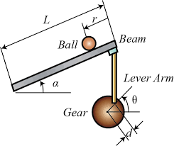
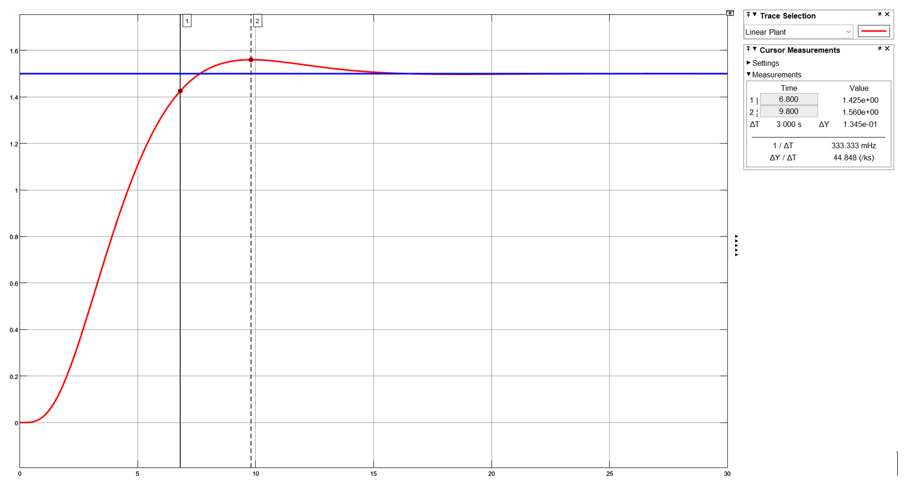
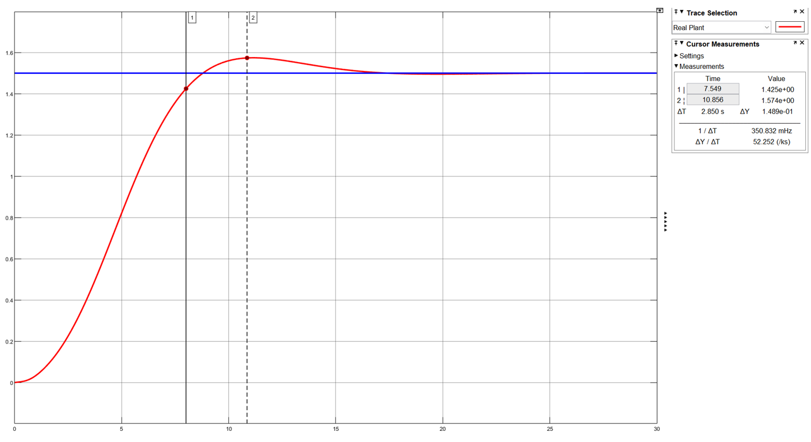
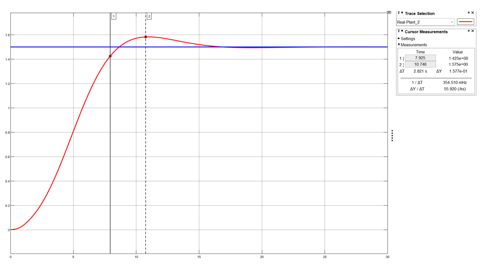
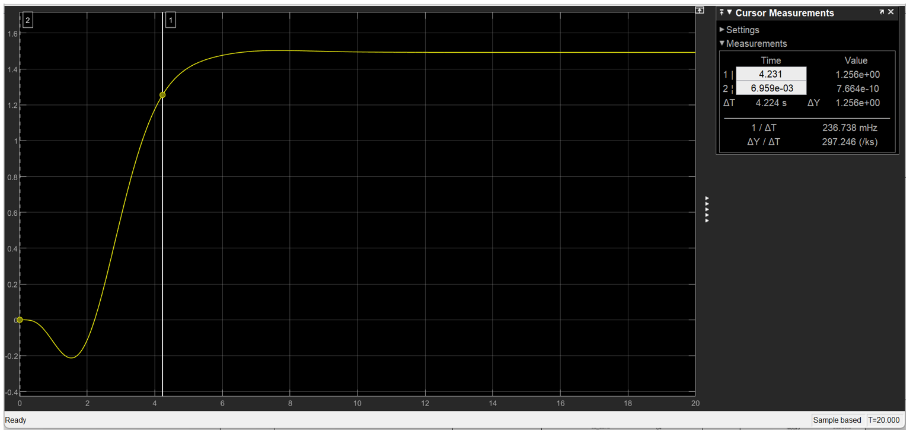
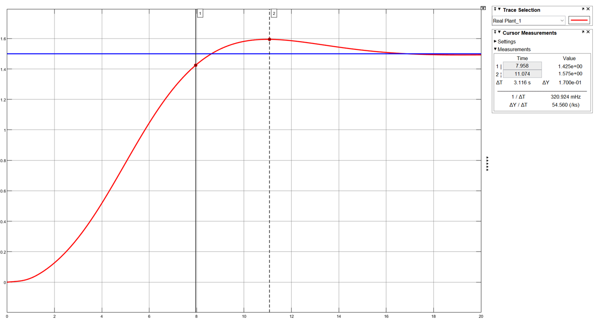

# Ball and Beam Control System Design

## Overview

This repository contains the modeling, controller design, simulation, and performance analysis of a **Ball and Beam control system** developed as a course project for *Fundamentals of Automatic Control Design*.

The main objective is to regulate the ball position on the beam while satisfying the following transient-response requirements:

- **Overshoot:** less than 20%
- **Settling time:** less than 7 s
- **Actuator voltage:** below 30 V

Several controller-design approaches were investigated and compared using **MATLAB** and **Simulink**. Both the **linearized model** and the **nonlinear model** of the Ball and Beam system were considered.

The project is organized into seven parts:

1. SISO-based PI/PID design with an auxiliary stabilizing controller
2. PID design using MATLAB PID Tuner
3. PID design using classical/analytical tuning methods
4. PID design using MATLAB PID optimization tools
5. Two-degree-of-freedom PID design
6. Comparison of all designed controllers
7. Performance evaluation under changes in ball mass and beam length

---

## System Description

The Ball and Beam system consists of a ball rolling along a beam whose angular position is controlled by a servo motor. The control objective is to regulate the ball position by changing the beam angle.

The nominal system parameters used in the project are :

| Parameter | Symbol | Value |
|---|---:|---:|
| Ball mass | $m$ | 1.5 kg |
| Lever-arm length | $d$ | 0.05 m |
| Ball radius | $a$ | 0.02 m |
| Beam length | $L$ | 3 m |
| Gear reduction | — | 5:1 |

The motor transfer function, before the gearbox, is

$$
\frac{\Theta(s)}{V(s)}=\frac{0.0274}{0.003228s^2+0.003508}.
$$

---
### Ball and Beam System



## Nonlinear and Linearized Ball Dynamics

The ball-position dynamics with respect to beam angle are described by

$$
\frac{R(s)}{\Theta(s)}=\frac{mg\sin(\alpha)}{\left(\frac{J}{a^2}+m\right)s^2},
$$

with the geometric relation

$$
\sin(\alpha)=\frac{d}{L}\sin(\theta).
$$

For a solid spherical ball,

$$
J=\frac{2}{5}ma^2.
$$

Using the small-angle approximation

$$
\sin(\theta)\approx\theta,
$$

the model is linearized as

$$
\frac{R(s)}{\Theta(s)}=\frac{mgd}{\frac{7}{5}Ls^2}.
$$

After combining the ball dynamics, motor model, and the 5:1 gearbox, the nominal linear plant used for controller design becomes

$$
G(s)=\frac{0.29739}{s^3(s+1.087)}.
$$

The nonlinear Simulink model retains the nonlinear geometric relation and is used to verify whether controllers designed from the linearized model remain effective on the more realistic system.

---

# Part 1 — SISO Controller Design with Auxiliary Stabilizer

The nominal plant has challenging open-loop dynamics, so an **auxiliary stabilizing controller** was first designed before tuning the outer PI controller.

Using an internal-model-based design, the auxiliary controller was derived from

$$
K=\frac{X+MQ}{Y-NQ},
$$

with

$$
N=G,\qquad M=1,\qquad X=0,\qquad Y=1.
$$

The selected filter was

$$
Q=
53.8
\frac{s^3(s+1.087)}
{(s+2)^4},
$$

which results in the stabilizing controller

$$
K(s)=53.8\frac{s^2(s+1.087)}{(s+4)(s^2+4s+8)}.
$$

The outer controller was then designed using the MATLAB **SISO Design Tool**.

### Closed-Loop Control Architecture

The designed auxiliary stabilizing controller was integrated with the outer PI controller, motor dynamics, gearbox, and Ball and Beam plant in a closed-loop Simulink model.

The same overall control architecture was used for both the linearized and nonlinear plant models, allowing the designed controllers to be evaluated under both modeling assumptions.

<p align="center">
  
</p>

<p align="center">
  <em>Closed-loop Simulink implementation of the Ball and Beam control system.</em>
</p>

### Linear-model controller

$$
C_{\mathrm{PI,lin}}(s)=0.054\frac{s+5}{s}=0.054+\frac{0.27}{s}.
$$

Therefore,

$$
K_P=0.054,\qquad K_I=0.27.
$$

The linear closed-loop response achieved:

| Metric | Result |
|---|---:|
| Settling time | 6.80 s |
| Overshoot | 4% |
| Control signal | 4.5 V |

### Nonlinear-model retuning

Applying the same controller directly to the nonlinear model produced a slower response. The controller gain was therefore increased, giving

$$
C_{\mathrm{PI,nonlin}}(s)=0.11\frac{s+5}{s}=0.11+\frac{0.55}{s}.
$$

Thus,

$$
K_P=0.11,\qquad K_I=0.55.
$$

The resulting nonlinear response was:

| Metric | Result |
|---|---:|
| Settling time | 7.5 s |
| Overshoot | 5% |
| Control signal | 8.5 V |

### Step Responses

**Linear model**




**Nonlinear model**




---

# Part 2 — PID Tuner Design

In this part, the outer controller was tuned using **MATLAB PID Tuner**, while retaining the auxiliary stabilizing controller from Part 1.

The tuned PI controller was

$$
C_{\mathrm{PI}}(s)=0.1138+\frac{0.5235}{s}.
$$

Therefore,

$$
K_P=0.1138,\qquad K_I=0.5235.
$$

For the nonlinear simulation, the reported closed-loop performance was:

| Metric | Result |
|---|---:|
| Settling time | 7.9 s |
| Overshoot | 5% |
| Control signal | 9.5 V |

The actuator voltage remained below the 30 V saturation limit.

### Step Responses

**Nonlinear model**



---

# Part 3 — Classical / Analytical PID Tuning Methods

This part investigates controller design using taught tuning methods, including classical and analytical approaches such as **Ziegler-Nichols**, **Åström-Hägglund**, and error-criterion-based methods.

The stabilized inner-loop plant was first approximated by a first-order model. Among the investigated approximations, the frequency-response approximation without delay was selected:

$$
G_F(s)=\frac{1}{1.936s+1}.
$$

Several candidate PI/PID controllers were then generated and compared.

The selected controller was

$$
C_3(s)=\frac{0.7568s^2+1.515s+0.9854}{0.02416s^2+s}.
$$

On the linearized model, with actuator saturation and anti-windup considered, the response achieved:

| Metric | Result |
|---|---:|
| Settling time | 4.23 s |
| Overshoot | 0% |

Although this controller performed well on the linear model, its nonlinear-model response exhibited significant undershoot and steady-state error.

### Step Responses

**Linear model**



---

# Part 4 — PID Optimization

In this section, PID controllers were designed using MATLAB optimization tools with several performance criteria:

- ITAE
- ISTE
- $IT^2SE$
- $IT^2AE$

The controllers were compared on the linear model. After accounting for actuator saturation and increasing the anti-windup gain, the **ITAE-based controller** was selected.

Its gains were

$$
K_P=1.6805,
\qquad
K_I=1.1198,
\qquad
K_D=0.93698.
$$

Therefore,

$$
C_4(s)=1.6805+\frac{1.1198}{s}+0.93698s.
$$

The linear-model response achieved:

| Metric | Result |
|---|---:|
| Settling time | 4.595 s |
| Overshoot | 3% |

The report also shows that this controller did not provide a satisfactory response on the nonlinear model.

---

# Part 5 — Two-Degree-of-Freedom PID

A **2-DOF PI controller** was designed using MATLAB PID Tuner to provide additional freedom in reference tracking.

The controller is expressed as

$$
u=0.0545(0.0201r-y)+0.5177\frac{1}{s}(r-y).
$$

The controller parameters are therefore

$$
K_P=0.0545,
\qquad
K_I=0.5177,
\qquad
b=0.0201.
$$

The nonlinear closed-loop response achieved:

| Metric | Result |
|---|---:|
| Settling time | 7.9 s |
| Overshoot | 5% |
| Control signal | 4.5 V |

### Step Responses

**Linear model**


**Nonlinear model**



---

# Part 6 — Controller Comparison

The final comparison reported in the project uses the **simulated nonlinear model** for Parts 1, 2, and 5, and the **linearized model** for Parts 3 and 4.

| Part | Controller Design Method | Auxiliary Stabilizer | Model Used for Reported Result | Overshoot | Settling Time |
|---:|---|:---:|---|---:|---:|
| 1 | SISO PI | Yes | Nonlinear model | 5% | 7.5 s |
| 2 | PID Tuner | Yes | Nonlinear model | 5% | 7.9 s |
| 3 | Classical / analytical tuning | Yes | Linearized model | 0% | 4.2 s |
| 4 | PID Optimization | Yes | Linearized model | 3% | 4.6 s |
| 5 | 2-DOF PID | Yes | Nonlinear model | 5% | 7.9 s |

Parts 3 and 4 show strong performance on the linearized model but do not provide satisfactory behavior when transferred directly to the nonlinear model. Among the controllers evaluated on the nonlinear model, the Part 1 SISO-based design was selected in the project for the subsequent parameter-variation study.

---

# Part 7 — Parameter Variation and Robustness Study

The controller selected from Part 1 was evaluated after changing important physical parameters of the Ball and Beam system. For each case, the auxiliary stabilizer and PI controller were retuned as required.

Three cases were studied:

1. Ball mass increased from 1.5 kg to 2 kg
2. Beam length reduced from 3 m to 1 m
3. Ball mass set to 2 kg and beam length set to 1 m simultaneously

## Case 1 — Ball Mass = 2 kg

The modified stabilizing controller was

$$
K(s)=40.351\frac{s^2(s+1.087)}{(s+4)(s^2+4s+8)}.
$$

The retuned PI controller was

$$
C(s)=0.14\frac{s+3}{s}=0.14+\frac{0.42}{s}.
$$

Hence,

$$
K_P=0.14,\qquad K_I=0.42.
$$

## Case 2 — Beam Length = 1 m

The modified stabilizing controller was

$$
K(s)=17.934\frac{s^2(s+1.087)}{(s+4)(s^2+4s+8)}.
$$

The retuned PI controller was

$$
C(s)=1.1\frac{s+1}{s}=1.1+\frac{1.1}{s}.
$$

Hence,

$$
K_P=1.1,\qquad K_I=1.1.
$$

## Case 3 — Ball Mass = 2 kg and Beam Length = 1 m

The modified stabilizing controller was

$$
K(s)=13.450\frac{s^2(s+1.087)}{(s+4)(s^2+4s+8)}.
$$

The retuned PI controller was

$$
C(s)=1.5\frac{s+0.67}{s}=1.5+\frac{1}{s}.
$$

Hence,

$$
K_P=1.5,\qquad K_I=1.
$$

## Robustness Results

| System Condition | Settling Time | Overshoot | Control Signal |
|---|---:|---:|---:|
| Nominal system | 7.5 s | 5% | 8.5 V |
| Ball mass = 2 kg | 5.1 s | 1.8% | 23 V |
| Beam length = 1 m | 4.5 s | 5% | 28 V |
| Ball mass = 2 kg, beam length = 1 m | 5.1 s | 1.5% | 29 V |

All three modified configurations remained below the 30 V actuator limit after controller retuning.

### Robustness Step Responses

**Ball mass = 2 kg**


---

## Repository Structure

```text
Ball-and-Beam-Control-Design/
│
├── README.md
│
├── 01_SISO_PID/
├── 02_PID_Tuner/
├── 03_Classical_PID/
├── 04_PID_Optimization/
├── 05_PID_2DOF/
├── 06_Controller_Comparison/
└── 07_Robustness_Analysis/
```

Each design folder contains the relevant **Simulink model**, available **MATLAB code**, and **simulation-result figures**.

---

## Software

- MATLAB
- Simulink
- Control System Toolbox
- PID Tuner
- SISO Design Tool / Control System Designer
- PID optimization tools

---

## Key Takeaways

This project demonstrates:

- Modeling and linearization of a nonlinear electromechanical system
- Design of an auxiliary stabilizing controller
- PI/PID tuning using multiple MATLAB workflows
- Classical and optimization-based controller design
- Two-degree-of-freedom PI/PID design
- Linear versus nonlinear closed-loop performance comparison
- Consideration of actuator saturation and anti-windup
- Controller retuning under physical-parameter variations
